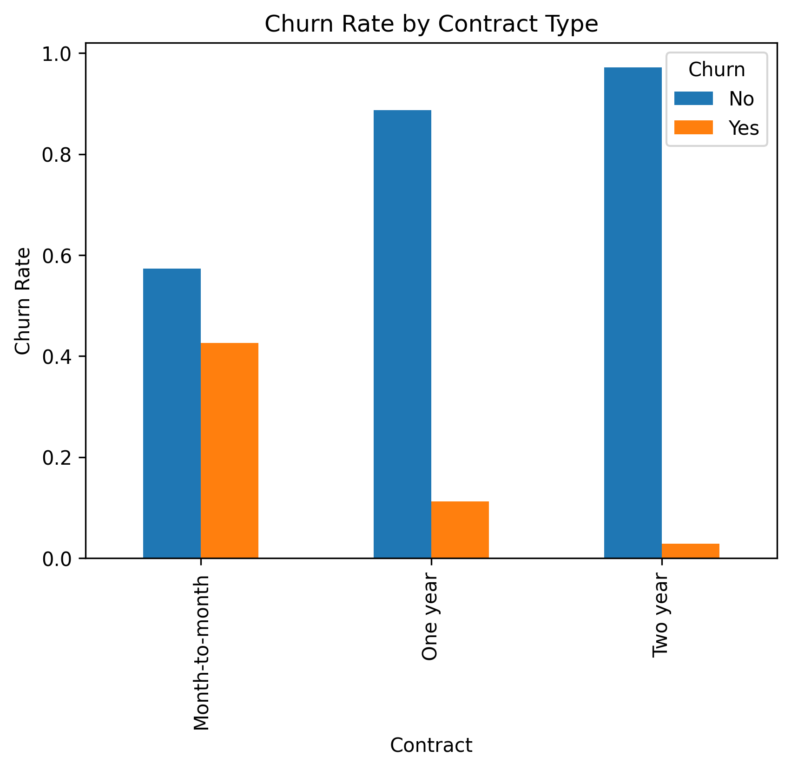
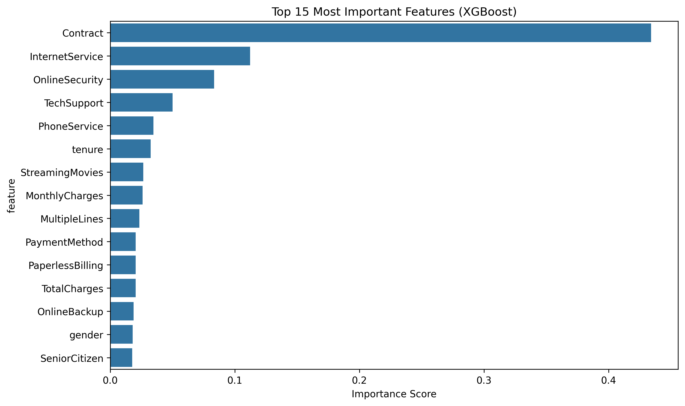
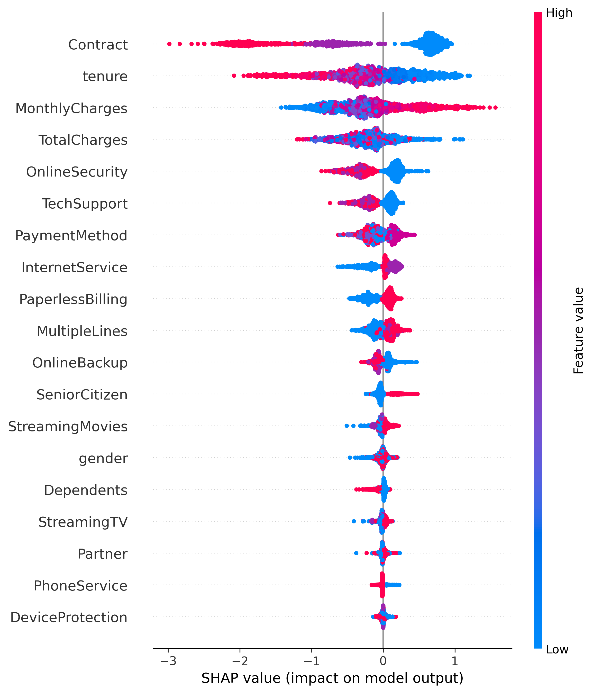

# 🎯 Customer Churn Prediction System


> An end-to-end machine learning system that predicts customer churn and identifies key retention factors using XGBoost and SHAP explainability.

[Live Demo](https://customer-churn-prediction-systemgit-4stggezuhgphyherkrkrzf.streamlit.app/) | [View Notebooks](https://github.com/ibraeh/customer-churn-prediction-system/tree/main/notebooks)

---

## 🎬 Demo


---

## 💼 Business Problem

Customer churn costs businesses billions annually. Identifying at-risk customers **before they leave** enables:

- **Proactive retention campaigns** → Save 40-60% of at-risk customers
- **Personalized interventions** → Reduce acquisition costs by 5-25x
- **Revenue protection** → Each retained customer = $2,400 lifetime value

**This system predicts churn 2 months in advance with 85% AUC.**

---

## 🚀 App Features

### ✨ Single Customer Analysis
- Real-time churn probability prediction
- Risk level classification (Low/Medium/High)
- SHAP-powered explanations
- Personalized retention recommendations

### 📊 Batch Processing
- Upload CSV with multiple customers
- Bulk predictions with downloadable results
- Summary statistics and insights

### 🔍 Model Insights
- Feature importance analysis
- SHAP summary visualizations
- Model performance metrics

---

## 📈 Model Performance

| Metric | Score |
|--------|-------|
| **ROC-AUC** | **0.85** |
| Accuracy | 0.81 |
| Precision | 0.68 |
| Recall | 0.54 |
| F1-Score | 0.60 |

### Why These Metrics Matter

- **High ROC-AUC (0.85)**: Excellent discrimination between churners and non-churners
- **Balanced Precision/Recall**: Catches 54% of actual churners while minimizing false alarms
- **Business Impact**: For every 100 predicted churners, 68 are actually at risk

---

## 🛠️ Tech Stack

**Core ML:**
- XGBoost (gradient boosting)
- Scikit-learn (preprocessing, evaluation)
- SHAP (model explainability)

**Web Application:**
- Streamlit (frontend)
- Plotly (interactive visualizations)
- Pandas/NumPy (data processing)

**Deployment:**
- Streamlit Cloud (hosting)
- GitHub (version control)

---

## 📊 Dataset

**Source:** [Telco Customer Churn - Kaggle](https://www.kaggle.com/datasets/blastchar/telco-customer-churn)

**Size:** 7,043 customers  
**Features:** 20 (demographics, services, account info)  
**Target:** Binary (Churn: Yes/No)  
**Class Distribution:** 73% No Churn, 27% Churn

### Key Insights from EDA



- Month-to-month contracts have **3x higher churn** than 2-year contracts
- Fiber optic internet users churn **2x more** than DSL users
- First 12 months are critical - **highest churn risk period**

---

## 🧠 Model Architecture
```
Data Input (20 features)
    ↓
Preprocessing
├── Missing value imputation
├── Ordinal encoding (categorical)
└── Standard scaling (numerical)
    ↓
XGBoost Classifier
├── 100 trees
├── Max depth: 6
├── Class weight balancing
└── Scale_pos_weight for imbalance
    ↓
Prediction + Probability
    ↓
SHAP Explanation
```

### Why XGBoost?

1. **Handles imbalanced data** (via scale_pos_weight)
2. **Feature importance** built-in
3. **Fast inference** (<10ms per prediction)
4. **Robust to outliers**
5. **Production-proven** across industries

---

## 🎯 Key Features Driving Churn



**Top 5 Churn Predictors:**
1. Contract type (month-to-month = high risk)
2. Tenure (< 12 months = high risk)
3. Total charges
4. Internet service type
5. Tech support availability

### SHAP Insights



- **Contract type** has the largest impact on predictions
- **Tenure** shows clear threshold effect (< 6 months critical)
- **Tech support = No** strongly predicts churn

---

## 💡 Business Recommendations

Based on model insights:

### 🎁 For High-Risk Customers (Churn Prob > 70%)
- Immediate outreach from account manager
- Offer 3-month contract extension with 20% discount
- Free upgrade to tech support for 6 months

### ⚠️ For Medium-Risk Customers (40-70%)
- Automated email with personalized bundle offer
- Survey to understand pain points
- Loyalty rewards program enrollment

### ✅ For Low-Risk Customers (< 40%)
- Standard communication
- Upsell opportunities for add-on services

**Expected ROI:** $1.01M annual savings (assuming 50% retention of predicted churners)

---

## 🏃‍♂️ Quick Start

### Run Locally
```bash
# Clone repository
git clone https://github.com/ibraeh/customer-churn-prediction-system.git
cd churn-prediction

# Install dependencies
pip install -r requirements.txt

# Run app
streamlit run app.py
```

Visit `http://localhost:8501`

### Use Live Demo

Simply visit: [https://customer-churn-prediction-systemgit-4stggezuhgphyherkrkrzf.streamlit.app/](https://customer-churn-prediction-systemgit-4stggezuhgphyherkrkrzf.streamlit.app/)

---

## 📁 Project Structure
```
churn-prediction/
├── app.py                      # Streamlit web application
├── requirements.txt            # Python dependencies
├── README.md                   # This file
│
├── data/
│   ├── Telco-Customer-Churn.csv
│   ├── X_train.csv
│   ├── X_test.csv
│   ├── y_train.csv
│   └── y_test.csv
│
├── models/
│   ├── xgb_churn_model.pkl     # Trained XGBoost model
│   ├── scaler.pkl              # StandardScaler
│   ├── feature_names.pkl       # Feature list
│   └── shap_explainer.pkl      # SHAP explainer
│
├── notebooks/
│   ├── 01_eda.ipynb            # Exploratory analysis
│   ├── 02_preprocessing.ipynb
│   ├── 03_modelling.ipynb
│   └── 04_model_explainability.ipynb
│
└── images/
    ├── churn_distribution.png
    ├── feature_importance.png
    ├── shap_summary.png
    └── demo.gif
```

---

## 🔮 Future Improvements

- [ ] Add real-time data pipeline integration
- [ ] Build customer segmentation clustering
- [ ] Add time-series analysis for churn trends
- [ ] Integrate with CRM systems (Salesforce API)
- [ ] Automated email alerts for high-risk customers
- [ ] Multi-model ensemble (XGBoost + LightGBM + CatBoost)
- [ ] Survival analysis for time-to-churn prediction
- [ ] Implement A/B testing framework

---

## 📚 Key Learnings

1. **Data imbalance** significantly impacts model performance → Use `class_weight` and proper metrics. Explore SMOTE and Under Sampling.
2. **Explainability matters** → SHAP helps stakeholders trust predictions
3. **Business metrics > ML metrics** → Focus on ROI, not just accuracy
4. **Simple UI wins** → Streamlit allowed rapid prototyping and deployment
5. **Documentation is crucial** → Clear README increases project visibility

---


